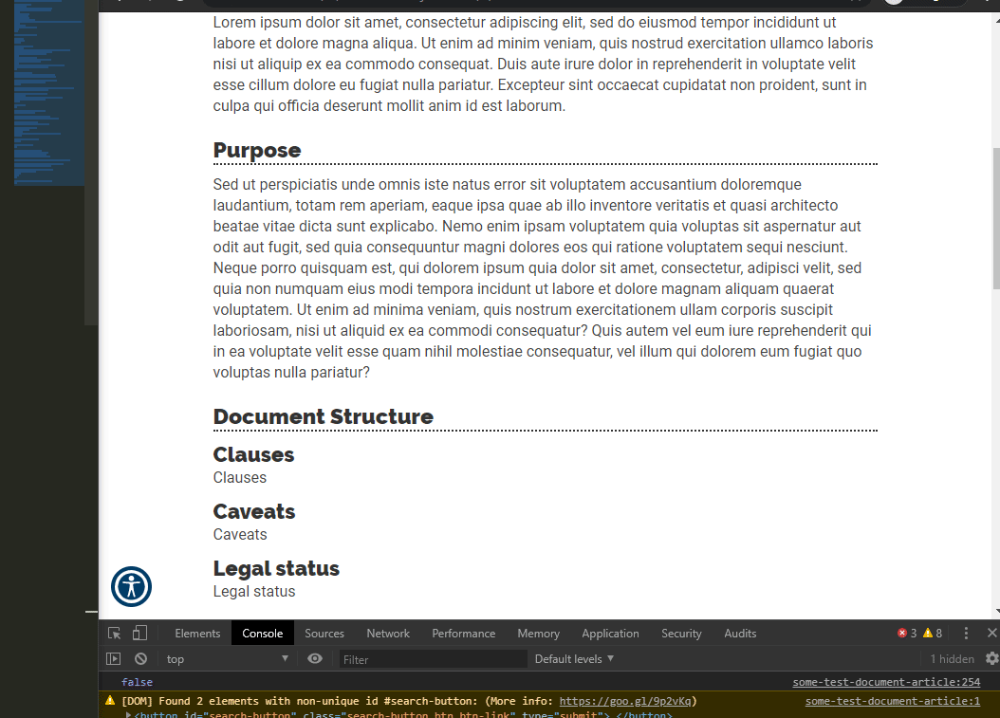
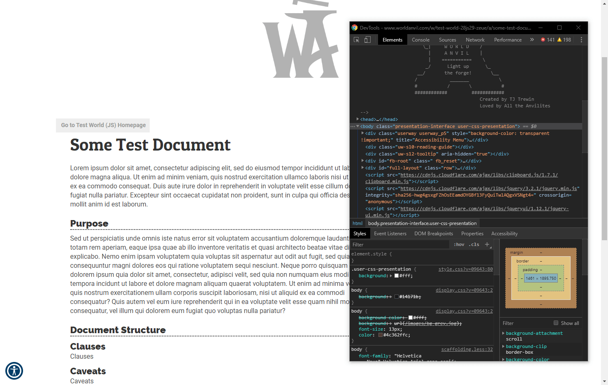

# ImageSlider

ImageSlider pulls images from the internet and plays them in a carousel-like element.



## How to use

Load the code and edit the `slider` constant at the top of the file. You will need to know the HTML tag of the title of the element you want to hide, for example:



In this example, I want the slider to be positioned underneath the "Purpose" section's title, so my `slider` constant will look like this:

```js
const slider = {
  images: [
    "https://i.imgur.com/PnBUQYp.jpg",
    "https://i.imgur.com/VQoZtY9.jpg"
  ],
  speed: 1000,
  position: {
    tag: "h2",
    text: "Purpose",
    offset: 0 // can be -1 for "just before" target in childNode tree
  },
  style: {
    maxHeight: "512px"
  }
};
```

And done! The `offset` property allows you to change which node the slider uses as it's position. You can also use -1 for the offset to place the slider **before** your target.

## Future Plans

- [ ] Buttons maybe? And captions?
