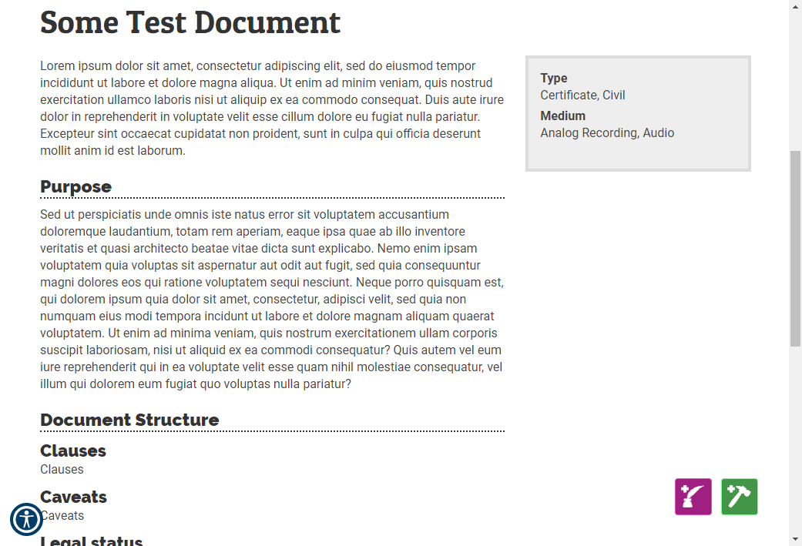
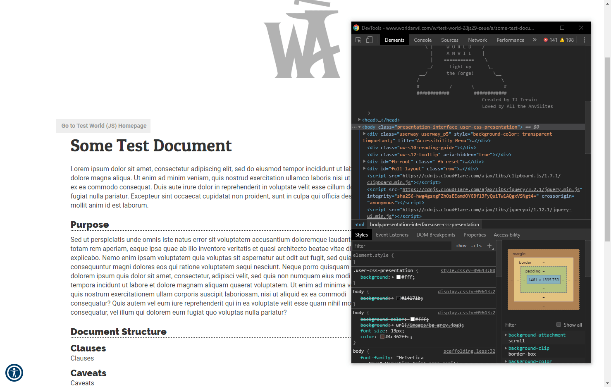

# SecretKeeper

SecretKeeper manipulates article sections to hide sensitive content. You can choose to just target the text content directly or hide it behind an interactive element, like a passcode lock!

The base code is kept in [base.js](base.js), but you can find more example implementations in the [examples](examples) folder. I personally like the idea of the [dictionary hack](examples/interactive/dictionaryHack.js) example (previewed below), which makes the viewer finish a simple little minigame to unlock the content.



## How to use

It's simple! Just load the base code (or an example implementation) and edit the `target` constant at the top of the file to match the specific secret you wish to hide. You will need to know the HTML tag of the title of the element you want to hide, for example:



In this example, I want to hide the content of the "Purpose" section, so my `target` constant will look like this:

```js
const target = {
  tag: "h2",
  text: "Purpose"
};
```

And done! It will use the section's paragraph below the title as the target of the script.

## Future Plans

- [ ] Make it cryptographically secure!
- [ ] More interesting interactive elements, like canvas-based games?
- [ ] Animations!
